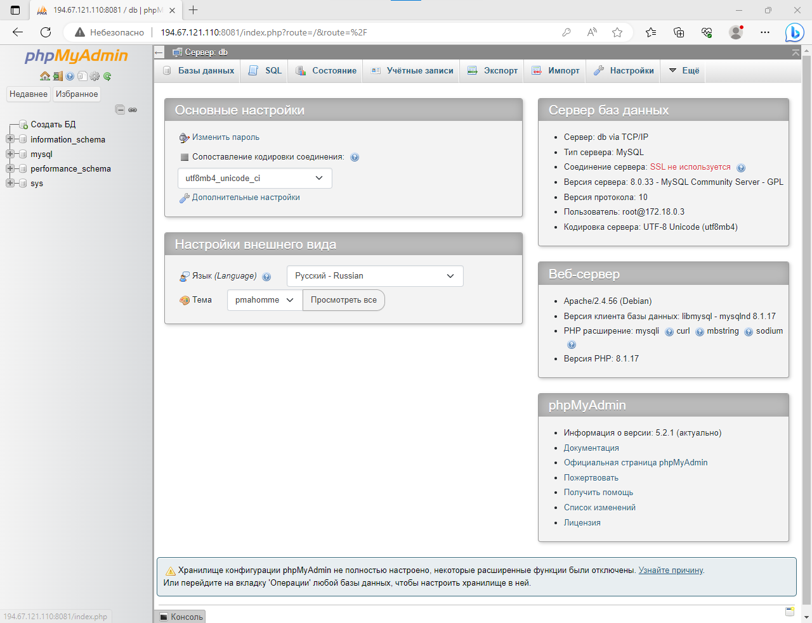

# Создадим YAML-файл для Docker Compose.
    root@194-67-121-110:~# mkdir seminar5
    root@194-67-121-110:~# cd seminar5
    root@194-67-121-110:~/seminar5# cat >> compose.yaml
    version: '3.9'
    services:
    db:
        image: mysql:latest
        restart: always
        environment:
        MYSQL_ROOT_PASSWORD: 12345
    admin:
        image: phpmyadmin/phpmyadmin:latest
        restart: always
        ports:
        - 8081:80
# Запустим наш проект.
    root@194-67-121-110:~/seminar5# docker compose up -d
    [+] Building 0.0s (0/0)
    [+] Running 3/3
    ✔ Network seminar5_default    Created                                                               0.2s
    ✔ Container seminar5-admin-1  Started                                                               1.4s
    ✔ Container seminar5-db-1     Started                                                               1.3s
# Убедимся, что все контейнеры работают.
    root@194-67-121-110:~/seminar5# docker ps
    CONTAINER ID   IMAGE                          COMMAND                  CREATED         STATUS         PORTS                                   NAMES
    13e685bc55fc   phpmyadmin/phpmyadmin:latest   "/docker-entrypoint.…"   2 minutes ago   Up 2 minutes   0.0.0.0:8081->80/tcp, :::8081->80/tcp   seminar5-admin-1
    4939ed7220f7   mysql:latest                   "docker-entrypoint.s…"   2 minutes ago   Up 2 minutes   3306/tcp, 33060/tcp                     seminar5-db-1
# Проверим доступность нашего сервиса через веб.
